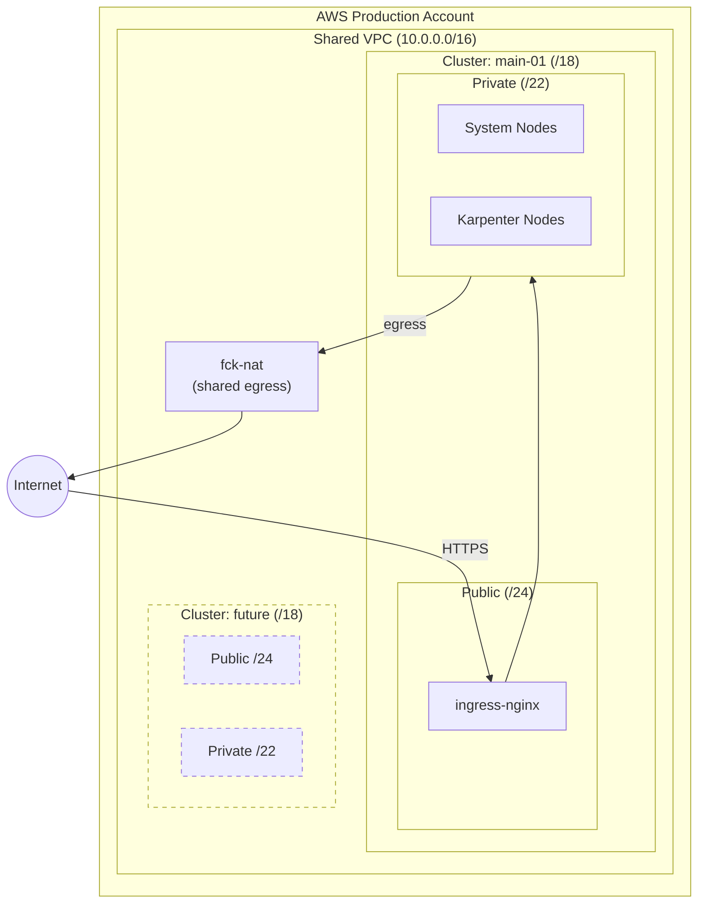

# Data Platform on Kubernetes

A production-ready data platform running [Dagster](https://dagster.io/) on Amazon EKS with comprehensive monitoring and alerting.

## Architecture Overview



### Key Components

| Component | Description | Why This Choice |
|-----------|-------------|-----------------|
| **EKS** | Managed Kubernetes (v1.31) | AWS-native, simple operations, IAM integration |
| **Karpenter** | Node autoscaling | Configurable, fast, supports Spot |
| **Dagster** | Data orchestration | part of requirements |
| **CloudNativePG** | PostgreSQL operator | In-cluster DB, no RDS cost |
| **KeyDB** | Redis-compatible broker | Used for celery job queue, faster than Redis |
| **ArgoCD** | GitOps | Automatic declarative deployments, drift detection |
| **Prometheus + Grafana** | Monitoring | Industry standard, rich ecosystem |
| **fck-nat** | Shared NAT instance | Much cheaper than NAT Gateway |

---

## How to Provision

We use [Terraform Cloud](https://app.terraform.io/) (Free Tier) to manage state and execute infrastructure changes globally.

### Prerequisites

- **AWS Management Account**: The root account for your organization.
- **Terraform Cloud Account**: An organization set up in TFC.
- **AWS CLI**: Installed and configured locally.
- **Terraform CLI**: Installed locally (>= 1.14).
- **kubectl**: Installed locally for cluster interaction.
- **GitHub App**: Installed in your repository/organization (required for ArgoCD and cluster permissions).

### Step 1: Bootstrap Management Account

1. **Create Temporary IAM User**:
   - Log into your AWS Management Console.
   - Create a temporary IAM user with `AdministratorAccess`.
   - Generate an Access Key ID and Secret Access Key.

2. **Enable IAM Identity Center**:
   - In the AWS Management Console (management account), navigate to **IAM Identity Center**.
   - Enable it in the region you plan to use (e.g., `eu-central-1`).
   - This is required for managing access and permissions across accounts.

3. **Configure Terraform Cloud**:
   - Create a new workspace in Terraform Cloud for the management environment.
   - Go to the **Workspaces/Settings/Variable Sets** page.
   - Add a new Variable Set (temporary credentials) and define these variables as **Environment Variables**:
     - `AWS_ACCESS_KEY_ID`
     - `AWS_SECRET_ACCESS_KEY`
     - `TFC_AWS_PROVIDER_AUTH` (set to `false`)

### Step 2: Configure Global Settings

1. **Define Global Variable Sets**:
   - In Terraform Cloud Settings, create **Variable Sets** for shared configuration (e.g., `aws_region`, `org_name`).
   - This ensures configuration is DRY (Don't Repeat Yourself) across environments.

2. **Configure GitHub App Variable Set**:
   - Create a Variable Set (e.g., `GitHub App Configuration`) with the following **Terraform Variables**:
     - `github_app_id`: The ID of your GitHub App.
     - `github_app_installation_id`: The installation ID of the App.
     - `github_organisation`: The GitHub organization name.
     - `github_app_private_key`: The private key of the GitHub App (mark as sensitive).

3. **Configure Environment-Specific Variables**:
   - Some variables are sensitive or environment-specific and are NOT defined in `terraform.tfvars`. You must set these in their respective TFC Workspaces or via Variable Sets.
   
   **Management Workspace:**
   - `security_account_email`: Email for the security account (audit).
   - `production_account_email`: Email for the production account.
   - `admin_user_email`: Email for the initial admin user.

   **Production Workspace:**
   - `root_route53_zone`: The DNS zone for the cluster (e.g., `platform.example.com`).
   - `letsencrypt_email`: Email for TLS certificate notifications.

4. **Assign to Workspaces**:
   - Apply these Variable Sets to your Management and Production workspaces.

### Step 3: Provision Production Support

With the management account bootstrapped and TFC configured:

1. **Review SSO Users**:
   - Check `infra/environments/management/terraform.tfvars`.
   - Ensure the `users` map contains the users you want to create in IAM Identity Center.
   - Example:
     ```hcl
     users = {
       "jdoe" = {
         email      = "jdoe@example.com"
         first_name = "John"
         last_name  = "Doe"
         groups     = ["administrators"]
       }
     }
     ```

2. **Run Provisioning**:
   - Trigger a run in Terraform Cloud.
   - This creates necessary IAM roles, enables IAM Identity Center, and creates the specified users.
    - users will receive an invitation email to set up their password.
3. **Verify Outputs**:
   - Note the `tfc_oidc_role_arn` from the output (e.g., `arn:aws:iam::123456789012:role/tfc-role`).

### Step 4: Configure TFC OIDC

Now that the management account has the OIDC identity provider and role configured, update Terraform Cloud to use it.

1. **Update Global Variable Set**:
   - Go to your **Variable Sets** in TFC.
   - Update the variables you set in Step 1:
     - `TFC_AWS_PROVIDER_AUTH` -> `true`
     - `TFC_AWS_RUN_ROLE_ARN` -> `<tfc_oidc_role_arn from Step 3>`
   - **Remove** the static credentials (`AWS_ACCESS_KEY_ID`, `AWS_SECRET_ACCESS_KEY`) as they are no longer needed.

2. **How it works**:
   - TFC now uses OIDC to authenticate with the **Management** account using this role.
   - For the **Production** account, TFC (acting as the management OIDC role) assumes the `OrganizationAccountAccessRole` in the Production account.
     - *See `infra/environments/production/providers.tf` for the `assume_role` configuration.*

### Step 5: Provision Production Environment

1. **Switch to Production Workspace**:
   - Ensure your Production workspace in TFC is configured with the roles created in the previous step (via OIDC or assumed roles).
2. **Apply Infrastructure**:
   - Queue a plan and apply it to provision the EKS cluster, VPCs, and data platform services.

```bash
# You can also trigger runs locally if TFC CLI is configured
cd infra/environments/production
terraform init
terraform apply
```

### Step 6: Configure Local Access (SSO)

Before interacting with the cluster, configured users must set up their local AWS CLI to use SSO.

1. **Login via SSO**:
   ```bash
   aws configure sso
   # SSO session name (Recommended): platform-sso
   # SSO start URL: https://<your-org>.awsapps.com/start
   # SSO region: eu-central-1
   # SSO registration scopes: sso:account:access
   ```

2. **Select Account**:
   - Select the **Production** account if prompted.
   - Select the **AdministratorAccess** (or appropriate) role.

3. **Verify Access**:
   ```bash
   aws sts get-caller-identity --profile platform-prod
   ```

### Step 7: Verify Deployment

```bash
# Update kubeconfig using the SSO profile
aws eks update-kubeconfig \
  --name platform-main-01 \
  --region eu-central-1 \
  --profile platform-prod

# Check ArgoCD connection
kubectl get applications -n argocd

# Check Dagster pods
kubectl get pods -n dagster
```

---

## How to Use

### Access the Dagster UI

Navigate to: `https://dagster.<your-cluster-domain>/`

Login is currently open (no authentication by default).

### Trigger a Job

1. Open Dagster UI
2. Go to **Assets** → Select all assets
3. Click **Materialize all**

### View Monitoring

| Dashboard | URL |
|-----------|-----|
| Grafana | `https://grafana.<your-cluster-domain>/` |
| Prometheus | `https://prometheus.<your-cluster-domain>/` |
| Celery Flower | `https://flower.<your-cluster-domain>/` |

### Check Alerts

Grafana alerts are configured to fire when a Dagster job fails. Check the **Dagster** folder in Grafana Alerting.

---

## How to Test

### Run the Demo Pipeline

The `data_pipeline_job` fetches simulated data, processes it, and generates a report:

```bash
# Via Dagster UI: Assets → Materialize all
# Or check the Runs page after triggering
```

### Verify Alerting Works

A test job is included that always fails:

```bash
# In Dagster UI:
# Jobs → test_failure_job → Launch Run
```

This should:
1. Push failure metrics to Prometheus
2. Trigger Grafana alert (check Alerting → Alert rules)

### Check Metrics Flow

```bash
# Verify Pushgateway has Dagster metrics
kubectl port-forward svc/prometheus-pushgateway -n monitoring 9091:9091
curl http://localhost:9091/metrics | grep dagster
```

---

## Technology Justification

### Why Dagster over Airflow?

While Dagster was a requirement for this project, it offers significant advantages over traditional orchestrators like Airflow:

- **Asset-Centric Orchestration**: Focuses on the data assets being produced rather than just the tasks executing them. This makes lineage and data quality dependencies explicit.
- **Developer Experience**: Superior local development workflow with the Dagit UI, allowing pipelines to be tested locally before deployment.
- **Type Safety & Testability**: Strongly typed inputs/outputs and a unit-testing-friendly architecture reduce production failures.
- **Modern Architecture**: Decoupled execution engine (user code runs separately from the daemon) improves stability and isolation.

### Why CloudNativePG over RDS?

- **Cost**: No hourly RDS charges, uses existing cluster capacity.
- **Portability**: Same manifests work anywhere.
- **Simplicity**: Managed by Kubernetes, automatic failover.

### Why Prometheus+Grafana over CloudWatch?

- **Cost Efficiency**: CloudWatch Custom Metrics cost ~$0.30/metric/month, which becomes expensive with high-cardinality data (e.g., metrics per asset or job ID). Prometheus stores millions of series efficiently within the cluster for a fixed compute resource cost.
- **Kubernetes Native**: The `kube-prometheus-stack` (Operator) automatically discovers targets via ServiceMonitors, making monitoring dynamic as pods scale.
- **Standardization**: PromQL and Grafana are the industry standard for cloud-native monitoring, offering portability that CloudWatch does not.
- **Alerting Flexibility**: Grafana Alerting decouples alert logic from the backend, supporting complex routing and multiple contact points (PagerDuty, Slack) easily.

### Why Karpenter over Cluster Autoscaler?

- **Speed**: 60 seconds to running pod vs 3+ minutes
- **Flexibility**: Provision exact instance types, Spot support
- **Consolidation**: Automatically bin-packs to reduce costs

### Why fck-nat over NAT Gateway?

- **Cost**: ~$3/month vs $32+/month per NAT Gateway
- **Sufficient**: Single NAT handles development/small production loads

---

## Project Structure

```
.
├── apps/
│   └── dagster-pipelines/     # Python pipeline code
├── docs/
│   └── runbooks/              # Incident response guides
├── gitops/
│   ├── org/                   # ArgoCD Organization and Project definitions
│   └── services/              # Helm/Kustomize overlays per service
├── infra/
│   ├── environments/          # Terraform environment deployments
│   └── modules/               # Reusable Terraform modules
└── README.md
```

---

## Related Links

- [Dagster Docs](https://docs.dagster.io/)
- [Karpenter Best Practices](https://karpenter.sh/docs/getting-started/)
- [CloudNativePG](https://cloudnative-pg.io/documentation/)
- [ArgoCD](https://argo-cd.readthedocs.io/)
