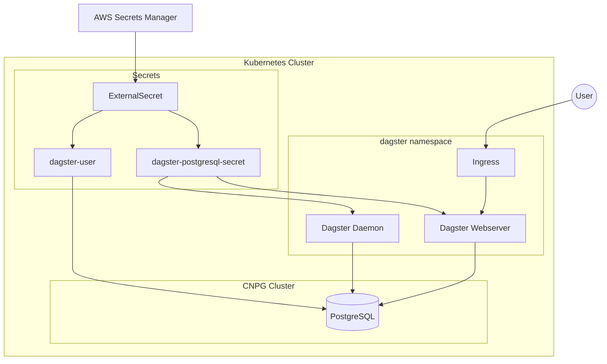

# Dagster Application Deployment

Deploy Dagster on EKS via ArgoCD, using CloudNativePG for PostgreSQL storage and nginx ingress for UI access.

## Architecture

```mermaid
flowchart TD
    subgraph K8s["Kubernetes Cluster"]
        subgraph dagster-ns["dagster namespace"]
            WS[Dagster Webserver]
            DM[Dagster Daemon]
            ing[Ingress]
        end
        subgraph cnpg["CNPG Cluster"]
            PG[(PostgreSQL)]
        end
        subgraph secrets["Secrets"]
            ESO[ExternalSecret]
            DPS[dagster-postgresql-secret]
            DU[dagster-user]
        end
    end
    
    AWS[AWS Secrets Manager] --> ESO
    ESO --> DPS
    ESO --> DU
    DU --> PG
    DPS --> WS
    DPS --> DM
    WS --> PG
    DM --> PG
    ing --> WS
    User((User)) --> ing
```
